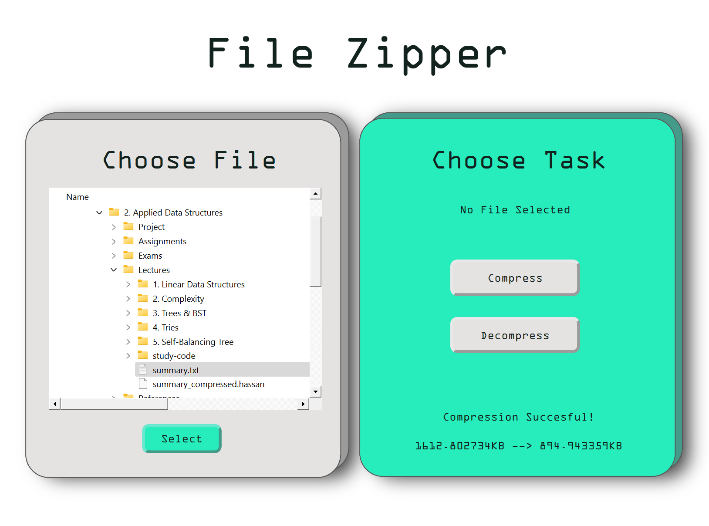
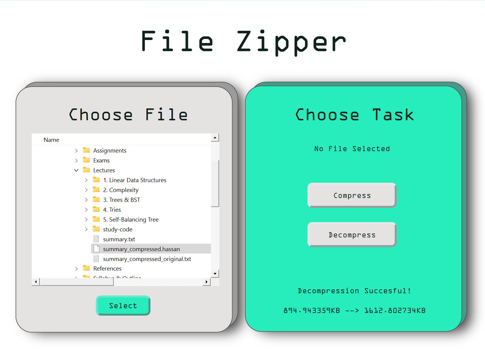

# Term-Project

🗃️ A text compression tool using Huffman Tree to efficiently compress and decompress text files with optimal encoding.

<div align="center">

<table>
  <tr>
    <td align="center"><strong>Compression</strong></td>
    <td align="center"><strong>Decompression</strong></td>
  </tr>
  <tr>
    <td></td>
    <td></td>
  </tr>
</table>

</div>


## Team members:
- Hassan Ashraf
- Youssef Ayman Hassan
- Adham ElRouby
- Mohammed Ali Hazem
- Mohammed Elsayed Salem

## Algorithms & Data Structures

### 1. Huffman Tree
To construct the Huffman Tree, the following steps are performed:
- **Initialize the Priority Queue**:  
  Each character with a non-zero frequency becomes a leaf. The priority queue sorts nodes by frequency, with the lowest at the top using a custom comparator.
- **Merge Nodes**:  
  Two nodes with the lowest frequency are removed, merged into a new inner node with a frequency equal to their sum, and reinserted into the queue.  
  This process continues until one node remains, becoming the tree's root.
- **Generate Codes**:  
  A recursive function generates binary codes for each character, appending '0' for left traversal and '1' for right traversal.

### 2. Encoding Algorithm
- **Create Temporary Storage**:  
  Iterate over each character in the input text, retrieve its ASCII value, and replace it with its corresponding Huffman code.
- **Convert Binary Data to 8-Bit Chunks**:  
  Slice the binary string into 8-bit chunks, convert each to a character, and handle any remaining bits by padding with zeros.
- **Store Padding Information**:  
  The number of padding bits is saved to ensure accurate data reconstruction during decompression.

### 3. Decoding Algorithm
- **Initialize Variables**:  
  An empty string stores the decoded text, and a pointer tracks the current position in the encoded text.
- **Iterative Decoding**:  
  Accumulate bits into a temporary string and check for matches in the Huffman Map. Once a match is found, append the corresponding character to the decoded text.
- **Update Position**:  
  Adjust the pointer to continue decoding the next segment of the encoded text.

### 4. Compression
- Verify the input file is a `.txt` file. If not, output an error and stop execution.
- Generate a frequency array and build the Huffman Tree and Map.
- Create a header structure for decompression, including:
  1. Character Byte (the letter)
  2. Huffman Code Size Byte
  3. Huffman Code encoded into bytes.
- Convert the file content to a binary string using the Huffman Map, encode it, and write the compressed content to a new file.

### 5. Decompression
- Verify the input file is a `.hassan` file. If not, output an error and stop execution.
- Reconstruct the Huffman Map from the header structure.
- Convert the binary string back to the original text by mapping binary sequences to their corresponding characters.
- Write the decompressed content into a new `.txt` file.

## Run Locally

Clone the project

```bash
  git clone https://github.com/Youssef-ayman55/File_Zipper.git
```

Go to the project directory

```bash
  cd .\File_Zipper
```

Open the project in Qt Creator

1. Launch Qt Creator.
2. Click on **File** > **Open File or Project**.
3. Select `file_zipper.pro`.
4. Click Open.

Build and Run the Project

1. Click on the **Build button** (or press `Ctrl+B`) to compile the project.
2. Click on the **Run button** (or press `Ctrl+R`) to run the project.

## Contributing

We welcome contributions to this project! Feel free to submit pull requests and suggest improvements. 
If you have any questions or need assistance, don’t hesitate to contact us at youssefayman55200@aucegypt.edu.
